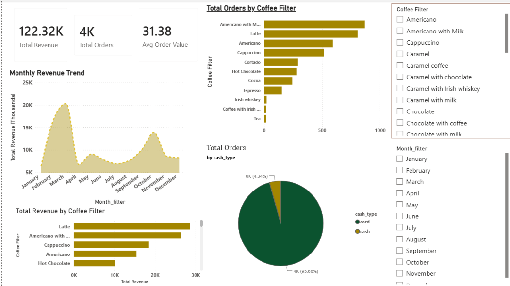

# ☕ Coffee Sales Analytics Dashboard

## 📌 Project Overview

This project presents an interactive Coffee Sales Analytics Dashboard developed using Microsoft Power BI. The dashboard analyzes coffee sales transactions to provide insights into revenue, order volume, product performance, and customer payment preferences. It enables users to monitor business performance through interactive visualizations and KPI metrics.

---

## 📷 Dashboard Preview

---

## 🎯 Business Objective

The objective of this project is to analyze coffee sales data, monitor business performance, identify sales trends, evaluate product demand, and support data-driven business decisions using interactive dashboards.

---

## 📊 Key Performance Indicators (KPIs)

- Total Revenue
- Total Orders
- Average Order Value
- Monthly Revenue Trend
- Revenue by Coffee Type
- Orders by Coffee Type

---

## 📈 Dashboard Features

- KPI Cards
- Monthly Revenue Trend Analysis
- Coffee-wise Revenue Analysis
- Coffee-wise Order Analysis
- Payment Method Distribution
- Interactive Coffee Filter
- Monthly Filter
- Pie Chart
- Line Chart
- Bar Charts

---

## 📂 Dataset

The dashboard is built using coffee sales transaction data containing:

- Date
- Date & Time
- Coffee Name
- Payment Method
- Sales Amount

---

## 🛠️ Tools & Technologies

- Microsoft Power BI
- Microsoft Excel / CSV
- Power Query
- DAX
- Data Modeling

---

## 💡 Key Insights

- Revenue trends can be monitored across different months.
- Product-wise analysis highlights the best-performing coffee varieties.
- Payment method analysis provides insights into customer purchasing behavior.
- Average Order Value helps measure transaction performance.
- Interactive filters allow users to explore sales data dynamically.

---

## 🚀 Skills Demonstrated

- Data Import and Validation
- Data Transformation using Power Query
- Data Modeling
- DAX Calculations
- KPI Dashboard Development
- Business Intelligence
- Data Visualization
- Insight Generation

---

## 📁 Repository Contents

- dashboard-overview.png
- coffee-sales-data.csv
- README.md

---

### ⭐ Project Outcome

Designed an interactive Power BI dashboard that provides a clear overview of coffee sales performance, enabling users to analyze revenue trends, product performance, order patterns, and payment methods for informed business decision-making.
